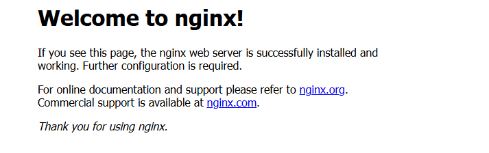

## 学んだこと

### コンテナに接続するためには？

- ポート番号を設定する必要がある。
  - Docker 側でポート番号を設定し、外部からアクセスできるようにするため。

### ポート とは？

- コンピュータ同士がネットワークで通信するときに使用する出入り口の番号を指す。
  - コンテナに出入り口を設定することで、外部からコンテナにアクセスすることができる。
  - IP アドレス＋ポート番号で接続すると…
    - その IP アドレスが振られている PC に接続し、ポート番号のサービスと通信することができる。
    - Docker の場合は、コンテナのポート番号と外部アクセス時のポート番号を紐づけしなければいけない。

### ホストとコンテナのポート番号を紐づける

- 以下の環境にて、`http://localhost:3000`でアクセスし、Nginx のページを表示したい。

#### コンテナ

- Nginx がインストールされている。
- ポート番号:80 番

#### ホストマシン

- ポート番号:3000 番

### コンテナ起動する

- `docker container run -p <ホストのポート番号:コンテナのポート番号> <イメージ名>`でホストとコンテナのポート番号を紐づけることができる。

```
> docker container run -p 3000:80 --rm nginx

/docker-entrypoint.sh: /docker-entrypoint.d/ is not empty, will attempt to perform configuration
/docker-entrypoint.sh: Looking for shell scripts in /docker-entrypoint.d/
/docker-entrypoint.sh: Launching /docker-entrypoint.d/10-listen-on-ipv6-by-default.sh
10-listen-on-ipv6-by-default.sh: info: Getting the checksum of /etc/nginx/conf.d/default.conf
10-listen-on-ipv6-by-default.sh: info: Enabled listen on IPv6 in /etc/nginx/conf.d/default.conf
/docker-entrypoint.sh: Sourcing /docker-entrypoint.d/15-local-resolvers.envsh
/docker-entrypoint.sh: Launching /docker-entrypoint.d/20-envsubst-on-templates.sh
/docker-entrypoint.sh: Launching /docker-entrypoint.d/30-tune-worker-processes.sh
/docker-entrypoint.sh: Configuration complete; ready for start up
2025/02/26 08:45:32 [notice] 1#1: using the "epoll" event method
2025/02/26 08:45:32 [notice] 1#1: nginx/1.27.4
2025/02/26 08:45:32 [notice] 1#1: built by gcc 12.2.0 (Debian 12.2.0-14)
2025/02/26 08:45:32 [notice] 1#1: OS: Linux 5.15.167.4-microsoft-standard-WSL2
2025/02/26 08:45:32 [notice] 1#1: getrlimit(RLIMIT_NOFILE): 1048576:1048576
2025/02/26 08:45:32 [notice] 1#1: start worker processes
2025/02/26 08:45:32 [notice] 1#1: start worker process 29
2025/02/26 08:45:32 [notice] 1#1: start worker process 30
2025/02/26 08:45:32 [notice] 1#1: start worker process 31
2025/02/26 08:45:32 [notice] 1#1: start worker process 32
2025/02/26 08:45:32 [notice] 1#1: start worker process 33
2025/02/26 08:45:32 [notice] 1#1: start worker process 34
2025/02/26 08:45:32 [notice] 1#1: start worker process 35
2025/02/26 08:45:32 [notice] 1#1: start worker process 36
```

- 起動後、`http://localhost:3000`にアクセスすると、以下 Nginx のページを表示することができた。
  

### Docker ネットワークとは？

- コンテナ同士の通信を簡単に行うことができる機能
  - 不要なコンテナ同士の通信を防ぐことができる。

### Docker ネットワークの確認方法

- `docker network ls`でネットワーク一覧を表示することができる。

```
> docker network ls

ETWORK ID     NAME               DRIVER    SCOPE
67ff56135b44   bridge             bridge    local
53713c5bc16a   host               host      local
5e56067c99c1   none               null      local
e6147610759a   travelog_default   bridge    local
// ネットワークを設定していない場合、bridgeに所属する。
```

### ブリッジネットワークとは？

- Docker の仮想ネットワークの一種で、コンテナ同士が通信できるようにする機能。
  - コンテナ起動時に特にネットワーク指定を行わない場合は、bredge ネットワークに所属する。
  - `docker network create`にて独自のブリッジネットワークを作成することができる。
    - コンテナ自体を隔離したい場合に使用する。
